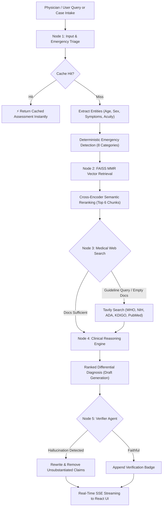

<div align="center">
  <h1>🩺 MediGuide AI 2.0</h1>
  <p><strong>Clinical Reasoning & Multi-Stage Medical RAG Assistant</strong></p>
  
  [](https://www.python.org/downloads/)
  [](https://react.dev/)
  [](https://fastapi.tiangolo.com/)
  [](https://tailwindcss.com/)
  [](https://python.langchain.com/)
  [](https://groq.com/)
  [](LICENSE)
</div>

---

**MediGuide AI 2.0** is an enterprise-grade clinical decision support and medical RAG (Retrieval-Augmented Generation) assistant. Built with a high-performance **React 19 + Tailwind CSS** frontend and a robust **FastAPI + LangGraph** backend, it performs multi-stage clinical reasoning, differential diagnosis ranking, and rule-out emergency triage grounded in authoritative medical reference materials (`Medical_book.pdf`) and real-time medical web sources (WHO, NIH, Mayo Clinic, PubMed).

---

## ✨ Modern React 2.0 UI Highlights

- **⚡ Real-time SSE Token Streaming**: True character-by-character streaming with live multi-stage pipeline status tracker.
- **🚨 Intelligent Emergency Triage Banner**: Instant deterministic red-flag detection (cardiac, stroke, anaphylaxis, respiratory) with 911 / 112 emergency call shortcuts.
- **🩺 Structured Patient Intake Form**: Clinical case builder for demographics, symptom tags, acuity scales, comorbidities, and medications.
- **🎙️ Hands-Free Voice Dictation**: Integrated speech-to-text for dictating clinical notes and symptoms hands-free.
- **🔊 Medical Text-to-Speech (TTS)**: High-clarity voice readouts of clinical reasoning assessments with adjustable speed rates (0.9x – 1.5x).
- **📚 Interactive Citations & Source Drawer**: Direct breakdown of PDF document page references and verified medical web domains.
- **🌓 Midnight Surgeon Dark & Clinical Light Modes**: Bespoke medical theme system with glassmorphism and subtle glowing accents.
- **📄 Instant Consultation Export**: Export full consultation or individual clinical assessments to formatted Markdown or Print-ready reports.
- **💾 Persistent Thread Management**: Pin, rename, search, filter, and delete chat threads with SQLite persistence.
- **⚡ Neural Answer Cache Monitor**: Live cache telemetry displaying hit counts, saved tokens, and one-click purge.
- **⚙️ Dynamic API Configuration**: Configure & test Groq API keys and model selection directly in the UI without restarting.

---

## 🛠️ Architecture & Tech Stack

| Layer | Technology | Details |
|---|---|---|
| **Frontend UI** | **React 19, Vite, Tailwind CSS** | Gemini-inspired UI (Light & Dark), borderless inputs, pill-bubbles, Markdown GFM |
| **Backend API** | **FastAPI, Uvicorn, SSE-Starlette** | High-concurrency async streaming REST & SSE API |
| **Orchestration** | **LangChain & LangGraph (5-Node Multi-Agent)** | `input_node` ➔ `retrieval` ➔ `web_search` ➔ `clinical_reasoning` ➔ `verifier_agent` |
| **LLM Engine** | **Groq Cloud & Google Gemini (Fallback Engine)** | `llama-3.3-70b-versatile` → `llama-3.1-8b` → `gemini-1.5-pro` |
| **Vector Database** | **FAISS (MMR Search)** | 384-dimensional dense embeddings (`fetch_k=30`, `k=12`) |
| **Embeddings** | **HuggingFace** | `sentence-transformers/all-MiniLM-L6-v2` |
| **Reranker** | **CrossEncoder** | `cross-encoder/ms-marco-MiniLM-L-6-v2` (Top 6 reranked) |
| **Web Search** | **Tavily API** | Trusted medical domains (WHO, NIH, Mayo Clinic, PubMed) |
| **Persistence & Cache** | **SQLite** | `chatbot.db` (Threads), `threads_meta.db` (Metadata), `answer_cache.db` (Cache) |

---

## 🧠 Clinical Reasoning Pipeline



---

## 🚨 Safety & Evaluation Metrics (v2 Harness)

MediGuide AI prioritizes **safety over helpfulness**. An integrated LLM-as-a-judge evaluation harness rigorously tests the pipeline against a golden test set of clinical scenarios.

- **Emergency Recall (True Positive Rate):** `100%` (Zero missed critical emergencies)
- **Emergency Specificity:** `85%+` (Slight over-triage is acceptable; missing is not)
- **Faithfulness Score:** `100%` (Zero hallucination rate—all claims rigorously mapped to retrieved evidence)

*See `evaluation/evaluate.py` for the complete automated testing harness and scorecard generation.*

---

## 🚀 Quick Start Guide

### 1. Prerequisites
- **Python 3.9+**
- **Node.js 18+** & **npm**
- **Groq API Key**: Get a free key from [console.groq.com](https://console.groq.com/)

### 2. Installation
```bash
# Clone the repository
git clone https://github.com/riteshpp05/MediGuide-AI.git
cd MediGuide-AI

# Install Python dependencies
pip install -r requirements.txt

# Install React dependencies and build
cd frontend-react
npm install
npm run build
cd ..
```

### 3. Configure API Keys
Create or update `.env` in the root directory:
```env
GROQ_API_KEY=your_groq_api_key_here
TAVILY_API_KEY=your_tavily_api_key_here # Optional for web search
GROQ_MODEL=llama-3.3-70b-versatile
```
*(Note: You can also configure your API keys directly inside the React UI Settings modal!)*

### 4. Ingest Medical Literature (Optional if index exists)
Place your medical PDFs inside `data/` and build the vector embeddings:
```bash
python backend.py --ingest
```

### 5. Launch the Application
Run the single-command launcher:
```bash
python run.py
```
Open **`http://localhost:8000`** in your browser.

---

## 💻 Development Mode (Hot Reloading)

To run backend and frontend with live hot reloading:

```bash
# Terminal 1 — Backend (FastAPI)
python server.py

# Terminal 2 — Frontend (Vite Dev Server)
cd frontend-react
npm run dev
```
Open **`http://localhost:3000`** (requests to `/api` are automatically proxied to `:8000`).

---

## 🐳 Docker Deployment

```bash
# Build and run containerized multi-stage setup
docker compose up -d --build
```
Access the application at `http://localhost:8000`.

---

## 📁 Project Structure

```text
mediguide-ai/
├── backend.py            # LangGraph multi-node RAG engine & FAISS vector search
├── server.py             # FastAPI REST & SSE streaming server
├── run.py                # Single-command unified full-stack launcher
├── requirements.txt      # Python dependencies
├── Dockerfile            # Optimized multi-stage Docker build
├── docker-compose.yml    # Container orchestration configuration
├── .env                  # Environment variables
├── data/                 # Raw reference medical PDFs (e.g. Medical_book.pdf)
├── faiss_index/          # Dense vector embeddings storage
├── answer_cache.db       # Version-aware SQLite response cache
├── chatbot.db            # LangGraph checkpoint persistence
├── threads_meta.db       # Conversation thread metadata and pin states
└── frontend-react/       # Modern React 19 Frontend Application
    ├── index.html        # HTML entry point with medical typography
    ├── package.json      # Dependencies (Lucide, Tailwind, React Markdown)
    ├── tailwind.config.js# Custom clinical & midnight color palettes
    ├── vite.config.js    # Vite configuration with API proxy
    └── src/
        ├── App.jsx       # Root state controller & shortcut listeners
        ├── api.js        # SSE stream client & REST API interface
        ├── index.css     # Glassmorphism, animations, scrollbars
        └── components/
            ├── Header.jsx                # Top telemetry bar & theme toggle
            ├── Sidebar.jsx               # Threads, search, pin, cache widget
            ├── ChatArea.jsx              # Hero, pipeline stepper, markdown, TTS
            ├── PatientIntakeModal.jsx    # Structured clinical case intake
            ├── SettingsModal.jsx         # API keys & model selector
            ├── KnowledgeBaseModal.jsx    # FAISS & PDF literature inspector
            ├── ExportModal.jsx           # Clinical consultation export & print
            └── KeyboardShortcutsModal.jsx# Power user keyboard shortcuts
```

---

## ⚠️ Medical Disclaimer

**⚕️ Medical Disclaimer**: This project is for **educational, clinical decision support, and research purposes only**. The AI synthesizes information based on uploaded medical textbooks and web references. It is **not** a substitute for direct clinical examination, professional medical diagnosis, or physician treatment orders. Always consult a licensed medical professional for personal health concerns.

---

## 📄 License
Licensed under the [MIT License](LICENSE).
