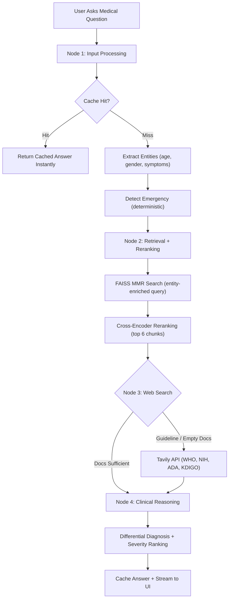
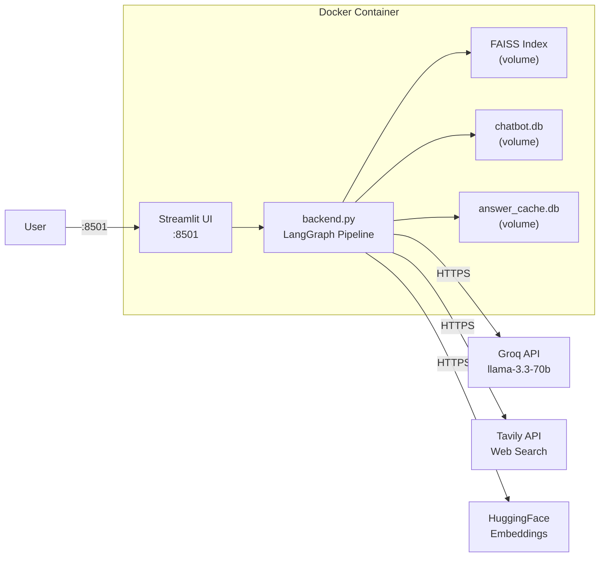

<div align="center">
  <h1>🩺 MediGuide AI</h1>
  <p><strong>Intelligent Medical Information Assistant</strong></p>
  
  <h3><a href="https://mediguide-ai-5aog8mjxpxfyyjcjk2iknb.streamlit.app/">🚀 LIVE DEMO: CLICK HERE TO TRY IT OUT!</a></h3>
  
  [](https://www.python.org/downloads/)
  [](https://streamlit.io/)
  [](https://python.langchain.com/)
  [](https://groq.com/)
  [](LICENSE)
</div>

---

MediGuide AI is an advanced medical RAG (Retrieval-Augmented Generation) chatbot. It combines the power of cloud LLMs via Groq, LangChain for orchestration, LangGraph for conversation state, and Streamlit for a sleek, responsive frontend. It intelligently grounds its answers in uploaded medical documents (PDFs) and trusted medical web sources to provide accurate, reliable, and well-cited information.

## 🚀 Key Features

- **📄 Document Knowledge Base**: Ingests medical PDFs using a FAISS vector store for fast, accurate retrieval.
- **🌐 Trusted Web Search**: Integrates Tavily API to fetch real-time medical data from authoritative sources (WHO, NIH, Mayo Clinic, WebMD).
- **🧠 Cloud LLM Integration**: Powered by `llama-3.3-70b-versatile` (via Groq) for lightning-fast inference.
- **💾 Conversation Memory**: Persistent chat threads powered by LangGraph and SQLite checkpointing.
- **⚡ Smart Caching System**: SQLite-based answer cache to save tokens, reduce latency, and track usage statistics.
- **🚨 Emergency Detection**: Instantly identifies critical medical situations and alerts the user to contact emergency services.
- **📚 Strict Citations**: Enforces a strict grounding rule where every claim must be backed by a cited source (Document or Web).
- **🟢 System Health Monitor**: Real-time dashboard in the sidebar showing LLM connectivity and Vector DB status.

## 🛠️ Architecture & Tech Stack

| Component | Technology |
|---|---|
| Frontend | Streamlit (custom CSS) |
| Orchestration | LangChain & LangGraph (4-node pipeline) |
| LLM Engine | Groq (`llama-3.3-70b-versatile`) |
| Vector Database | FAISS (Facebook AI Similarity Search) |
| Embeddings | HuggingFace (`all-MiniLM-L6-v2`) |
| Reranker | CrossEncoder (`ms-marco-MiniLM-L-6-v2`) |
| Web Search | Tavily API |
| State & Caching | SQLite (`chatbot.db` + `answer_cache.db`) |

## 🧠 How It Works — Clinical Reasoning Pipeline



The system goes **beyond simple RAG summarization** — it performs **clinical reasoning** with differential diagnosis:

### Node 1 — Input Processing (No LLM Call)
- **Cache Check**: Version-aware hash (`question + prompt_version + model_version + KB_version`) ensures stale answers are never served.
- **Entity Extraction**: Regex-based extraction of age, gender, symptoms, severity, and duration from the query.
- **Emergency Detection**: Deterministic pattern matching across 8 categories (cardiac, stroke, respiratory, neurological, toxicological, psychiatric, hemorrhagic, allergic). Fires *before* any retrieval for minimal latency.
- **Chat History**: Formats the last 6 messages for follow-up pronoun resolution.

### Node 2 — Retrieval + Reranking
- **Enriched Query**: Extracted entities are appended to the original question for better FAISS recall.
- **MMR Retrieval**: Fetches 12 diverse candidate chunks from the FAISS index.
- **Cross-Encoder Reranking**: `ms-marco-MiniLM-L-6-v2` scores each chunk against the query and keeps the top 6 most relevant.

### Node 3 — Web Search (Conditional)
- Triggers automatically for **guideline queries** (keywords: `latest`, `guideline`, `recommendation`, `2025`, `protocol`, `standard of care`) or when local documents have no results.
- Searches trusted medical domains: WHO, NIH, Mayo Clinic, WebMD, ADA, KDIGO, Cochrane, PubMed.

### Node 4 — Clinical Reasoning (Single LLM Call)
- Receives: patient summary, reranked evidence, web results, emergency status, chat history.
- **Clinical scenarios** (patient info detected) → Produces: Patient Summary → Clinical Interpretation → Ranked Differential Diagnoses → Recommended Actions → Emergency Warning Signs → Missing Information → Sources.
- **Simple questions** (no patient info) → Produces: Direct Answer → Details → Sources.
- Caches the answer (skips emergencies, fallbacks, off-topic responses).

## 📋 Prerequisites

Before running the project, ensure you have the following installed:
- **Python** 3.9 or higher
- **Git**
- **Groq API Key**: Get it from [console.groq.com](https://console.groq.com/)

## ⚙️ Setup & Installation

### 1. Clone the repository
```bash
git clone https://github.com/your-username/mediguide-ai.git
cd mediguide-ai
```

### 2. Create a Virtual Environment
```bash
python -m venv venv
# On Windows:
venv\Scripts\activate
# On macOS/Linux:
source venv/bin/activate
```

### 3. Install Dependencies
```bash
pip install -r requirements.txt
```

### 4. Configure Environment Variables
Create a `.env` file in the root directory and add your Tavily API Key for web search fallback:
```env
TAVILY_API_KEY=your-tavily-api-key-here
GROQ_API_KEY=your-groq-api-key-here
# Optional configurations:
# GROQ_MODEL=llama-3.3-70b-versatile
# CHUNK_SIZE=1000
# CHUNK_OVERLAP=200
```

### 5. Ingest Knowledge Base
Create a `data/` folder and place your reference medical PDFs inside it. Then, build the FAISS vector index:
```bash
python backend.py --ingest
```

### 6. Run the Application
Launch the Streamlit frontend:
```bash
streamlit run frontend.py
```
Open your browser and navigate to `http://localhost:8501`.

### 7. 🐳 Docker Deployment (Production)

We provide a fully optimized, multi-stage Docker setup. The image is aggressively optimized (CPU-only PyTorch) to keep the footprint under 1 GB.

**Using Docker Compose (Recommended):**
```bash
docker compose up -d --build
```
This will automatically map port `8501` and create persistent volumes for your chat history and cache databases.

**Architecture Inside Docker:**


## 📁 Project Structure

```text
mediguide-ai/
├── backend.py            # Core RAG logic, LangGraph setup, DB operations
├── frontend.py           # Streamlit UI, chat interface, state management
├── requirements.txt      # Python dependencies
├── Dockerfile            # Optimized multi-stage Docker build
├── docker-compose.yml    # Production deployment configuration
├── .dockerignore         # Docker context exclusions
├── .env                  # Environment variables (Groq/Tavily API)
├── data/                 # Directory for your raw medical PDFs
├── evaluation/           # Medical test cases
├── faiss_index/          # Generated vector embeddings directory
├── answer_cache.db       # SQLite DB for caching AI responses
└── chatbot.db            # SQLite DB for LangGraph thread persistence
```

## ⚠️ Disclaimer

**⚕️ Medical Disclaimer**: This project is for **educational and research purposes only**. The AI provides information based on uploaded references and web searches. It is **not** a substitute for professional medical advice, diagnosis, or treatment. Always seek the advice of your physician or other qualified health provider with any questions you may have regarding a medical condition.

## 🤝 Contributing
Contributions, issues, and feature requests are welcome! Feel free to check the [issues page](https://github.com/riteshpp05).

## 📄 License
This project is licensed under the MIT License - see the LICENSE file for details.
