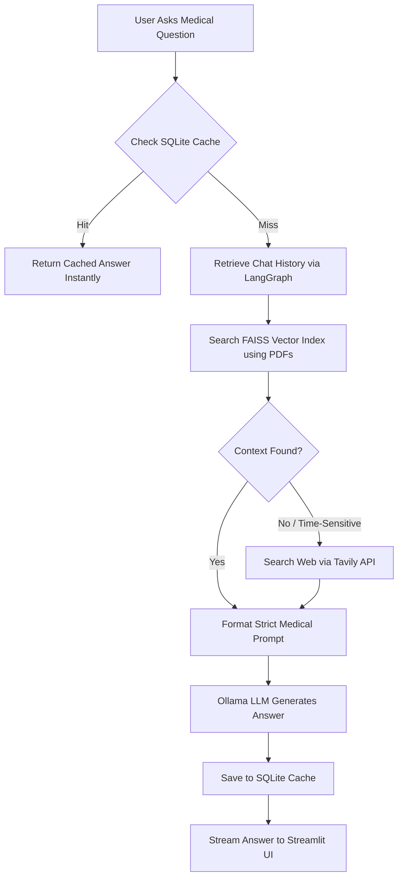

<div align="center">
  <h1>🩺 MediGuide AI</h1>
  <p><strong>Intelligent Medical Information Assistant</strong></p>
  
  [](https://www.python.org/downloads/)
  [](https://streamlit.io/)
  [](https://python.langchain.com/)
  [](https://ollama.ai/)
  [](LICENSE)
</div>

---

MediGuide AI is an advanced, locally-hosted medical RAG (Retrieval-Augmented Generation) chatbot. It combines the power of local LLMs via Ollama, LangChain for orchestration, LangGraph for conversation state, and Streamlit for a sleek, responsive frontend. It intelligently grounds its answers in uploaded medical documents (PDFs) and trusted medical web sources to provide accurate, reliable, and well-cited information.

## 🚀 Key Features

- **📄 Document Knowledge Base**: Ingests medical PDFs using a FAISS vector store for fast, accurate retrieval.
- **🌐 Trusted Web Search**: Integrates Tavily API to fetch real-time medical data from authoritative sources (WHO, NIH, Mayo Clinic, WebMD).
- **🧠 Local LLM Integration**: Powered by `gemma4:31b-cloud` (via Ollama) for completely private and offline inference.
- **💾 Conversation Memory**: Persistent chat threads powered by LangGraph and SQLite checkpointing.
- **⚡ Smart Caching System**: SQLite-based answer cache to save tokens, reduce latency, and track usage statistics.
- **🚨 Emergency Detection**: Instantly identifies critical medical situations and alerts the user to contact emergency services.
- **📚 Strict Citations**: Enforces a strict grounding rule where every claim must be backed by a cited source (Document or Web).
- **🟢 System Health Monitor**: Real-time dashboard in the sidebar showing LLM connectivity and Vector DB status.

## 🛠️ Architecture & Tech Stack

- **Frontend**: Streamlit (with custom premium CSS styling)
- **Orchestration**: LangChain & LangGraph
- **LLM Engine**: Ollama (`gemma4:31b-cloud`)
- **Vector Database**: FAISS (Facebook AI Similarity Search)
- **Embeddings**: HuggingFace (`all-MiniLM-L6-v2`)
- **Web Search**: Tavily API
- **State & Caching**: SQLite (`chatbot.db` and `answer_cache.db`)

## 🧠 How It Works (The RAG Pipeline)



When a user asks a medical question, the system follows a strict, multi-step pipeline to ensure accuracy and reduce hallucinations:

1. **Answer Cache Check**: The system hashes the user's question and checks the local `answer_cache.db`. If a valid, non-expired answer exists, it is returned instantly, saving API tokens and time.
2. **Conversation Memory**: LangGraph retrieves the current thread's chat history from `chatbot.db` to resolve follow-up questions and context (e.g., "What are the symptoms of *it*?").
3. **Primary Retrieval (Local RAG)**: The question is converted into embeddings and searched against the local FAISS index containing your uploaded medical PDFs.
4. **Fallback Retrieval (Web Search)**: If the local documents yield no relevant results, or if the question is time-sensitive (e.g., "latest treatments in 2024"), the Tavily API searches trusted medical domains (NIH, WHO, Mayo Clinic).
5. **Prompt Formulation**: The retrieved context (PDF + Web) and chat history are injected into a strict system prompt that enforces safety rules (e.g., Emergency Detection) and exact citations.
6. **LLM Generation**: The local Ollama model (`gemma4:31b-cloud`) generates the final response, which is streamed back to the Streamlit UI. Every factual claim is strictly cited.
7. **Store in Cache**: The generated answer is saved back to `answer_cache.db` for future identical queries.

## 📋 Prerequisites

Before running the project, ensure you have the following installed:
- **Python** 3.9 or higher
- **Git**
- **Ollama**: Download and install from [ollama.com](https://ollama.com/)

Once Ollama is installed, pull the required model:
```bash
ollama run gemma4:31b-cloud
```
*(Note: If you are using a different model, update the `.env` file accordingly).*

## ⚙️ Setup & Installation

### 1. Clone the repository
```bash
git clone https://github.com/your-username/mediguide-ai.git
cd mediguide-ai
```

### 2. Create a Virtual Environment
```bash
python -m venv venv
# On Windows:
venv\Scripts\activate
# On macOS/Linux:
source venv/bin/activate
```

### 3. Install Dependencies
```bash
pip install -r requirements.txt
```

### 4. Configure Environment Variables
Create a `.env` file in the root directory and add your Tavily API Key for web search fallback:
```env
TAVILY_API_KEY=your-tavily-api-key-here
# Optional configurations:
# OLLAMA_MODEL=gemma4:31b-cloud
# CHUNK_SIZE=1000
# CHUNK_OVERLAP=200
```

### 5. Ingest Knowledge Base
Create a `data/` folder and place your reference medical PDFs inside it. Then, build the FAISS vector index:
```bash
python backend.py --ingest
```

### 6. Run the Application
Launch the Streamlit frontend:
```bash
streamlit run frontend.py
```
Open your browser and navigate to `http://localhost:8501`.

## 📁 Project Structure

```text
mediguide-ai/
├── backend.py            # Core RAG logic, LangGraph setup, DB operations
├── frontend.py           # Streamlit UI, chat interface, state management
├── requirements.txt      # Python dependencies
├── .env                  # Environment variables (Tavily API, Config)
├── data/                 # Directory for your raw medical PDFs
├── faiss_index/          # Generated vector embeddings directory
├── answer_cache.db       # SQLite DB for caching AI responses
└── chatbot.db            # SQLite DB for LangGraph thread persistence
```

## ⚠️ Disclaimer

**⚕️ Medical Disclaimer**: This project is for **educational and research purposes only**. The AI provides information based on uploaded references and web searches. It is **not** a substitute for professional medical advice, diagnosis, or treatment. Always seek the advice of your physician or other qualified health provider with any questions you may have regarding a medical condition.

## 🤝 Contributing
Contributions, issues, and feature requests are welcome! Feel free to check the [issues page](https://github.com/your-username/mediguide-ai/issues).

## 📄 License
This project is licensed under the MIT License - see the LICENSE file for details.
